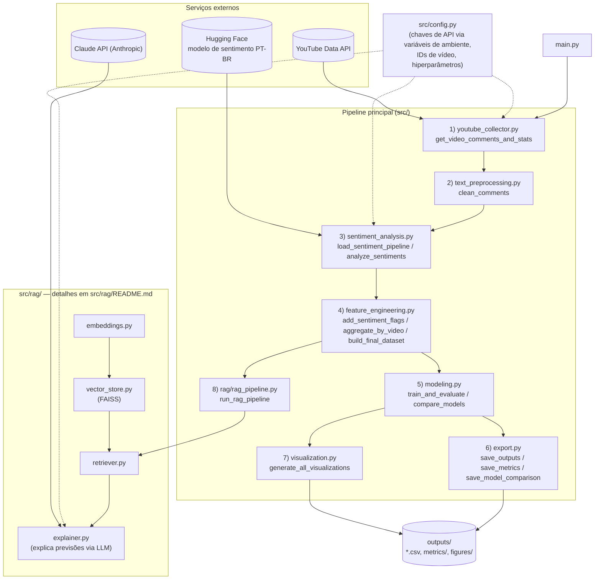

# Arquitetura do Projeto

Pipeline modular para predição de engajamento em vídeos do YouTube a partir da análise de sentimento dos comentários, com uma camada RAG (Retrieval-Augmented Generation) para explicar as previsões em linguagem natural.

> Documentação complementar mais granular: [`docs/architecture.md`](docs/architecture.md) (mesmo diagrama), [`docs/pipeline.md`](docs/pipeline.md) (entradas/saídas função a função), [`docs/dependencies.md`](docs/dependencies.md) (grafo de imports — quem chama quem), [`docs/ml.md`](docs/ml.md) (treino, avaliação e exportação dos modelos) e [`src/rag/README.md`](src/rag/README.md) (arquitetura interna do RAG: embeddings, vector store, retriever). Este arquivo é o ponto de entrada único que consolida todos eles.

## Árvore completa do projeto

```
TCC_Engajamento/
├── ARCHITECTURE.md                          # este arquivo
├── README.md (não existe ainda)
├── main.py                                  # ponto de entrada: python main.py -> run_pipeline()
├── requirements.txt                         # dependências pinadas (pandas, sklearn, xgboost, transformers,
│                                             # matplotlib, sentence-transformers, faiss-cpu, anthropic, ...)
├── tcc_script.py                            # script monolítico ORIGINAL da orientadora — mantido intocado
│                                             # como referência; não é usado pelo pipeline modular
├── 4+-+Artigo+Jhonny+Anthony+Ribeiro (1).pdf # artigo de referência (metodologia de análise diagnóstica com PLN)
├── Boneco_projeto (2).docx                  # planejamento completo do TCC (problema, hipóteses, cronograma)
│
├── docs/
│   ├── architecture.md                      # diagrama + visão geral (subconjunto deste arquivo)
│   └── pipeline.md                          # detalhamento função a função (entrada/saída/efeitos colaterais)
│
├── src/                                     # pacote principal
│   ├── __init__.py                          # vazio, torna src/ um pacote Python
│   ├── config.py                            # ETAPA 0 — única fonte de configuração (ver tabela abaixo)
│   ├── youtube_collector.py                 # ETAPA 1 — coleta via YouTube Data API
│   ├── text_preprocessing.py                # ETAPA 2 — limpeza de texto
│   ├── sentiment_analysis.py                # ETAPA 3 — análise de sentimento (Hugging Face Transformers)
│   ├── feature_engineering.py               # ETAPA 4 — agregação por vídeo + métrica alvo
│   ├── modeling.py                          # ETAPA 5 — treino, avaliação e comparação de modelos de ML
│   ├── export.py                            # ETAPA 6 — persistência em CSV
│   ├── visualization.py                     # ETAPA 7 — geração de gráficos (matplotlib)
│   ├── pipeline.py                          # orquestra as etapas 1–8 em ordem (run_pipeline())
│   │
│   └── rag/                                 # ETAPA 8 — camada RAG, independente do ML
│       ├── __init__.py                      # vazio, torna rag/ um subpacote
│       ├── README.md                        # arquitetura detalhada deste subpacote
│       ├── embeddings.py                    # geração de embeddings (SentenceTransformer) — genérico, sem
│       │                                     # dependência de outros módulos do projeto
│       ├── vector_store.py                  # índice vetorial FAISS (build/search/save/load) — genérico
│       ├── retriever.py                     # combina embeddings.py + vector_store.py num retriever reutilizável
│       ├── rag_pipeline.py                  # orquestra a indexação dos comentários (chamado por pipeline.py)
│       └── explainer.py                     # gera explicações em linguagem natural via Claude API,
│                                             # opcionalmente enriquecidas com o retriever
│
├── outputs/                                 # GERADO EM RUNTIME (não versionar) — ver seção "Saídas"
│   ├── comentarios_processados.csv
│   ├── dataset_final_videos.csv
│   ├── metrics/
│   │   ├── metrics.csv
│   │   └── comparacao_modelos.csv
│   └── figures/
│       └── *.png (até 8 gráficos)
│
└── venv/                                    # ambiente virtual Python (não versionar)
```

## Diagrama de arquitetura



## Fluxo completo do pipeline — da coleta ao RAG

`main.py` chama `run_pipeline()` (`src/pipeline.py`), que executa as 8 etapas abaixo em sequência, sempre passando o `DataFrame` de uma etapa como entrada da próxima.

### Etapa 1 — Coleta
**Módulo:** `youtube_collector.py` · **Função:** `get_video_comments_and_stats(api_key, video_ids, max_comments=100)`
Chama a YouTube Data API v3 para cada `video_id` em `config.VIDEO_IDS`. Para cada vídeo, busca estatísticas (`views`, `likes`, título) e até `max_comments` comentários de topo.
**Saída:** `df_comments` (`video_id`, `text`) e `df_videos` (`video_id`, `video_title`, `views`, `likes`, `total_comments_count`).
Falhas por vídeo (`HttpError`/`KeyError`/`ValueError`) são logadas e não interrompem os demais. Se `df_comments` vier vazio, o pipeline levanta `ValueError` e para.

### Etapa 2 — Pré-processamento
**Módulo:** `text_preprocessing.py` · **Função:** `clean_comments(df, min_length=3)`
Remove URLs, `@menções`, `#hashtags` e caracteres especiais de cada comentário (`clean_text`); descarta comentários com texto limpo muito curto.
**Saída:** `df_comments` + coluna `cleaned_text`.

### Etapa 3 — Análise de sentimentos
**Módulo:** `sentiment_analysis.py` · **Funções:** `load_sentiment_pipeline(model_name)` + `analyze_sentiments(df, 'cleaned_text', pipeline, max_length=512)`
Carrega o modelo `finiteautomata/bertwithsmiles-portuguese-tweets` (Hugging Face `transformers`) e classifica cada comentário. Falhas de inferência por comentário caem no fallback `{'label': 'NEUTRAL', 'score': 0.5}`.
**Saída:** `df_comments` + colunas `label`, `score`.

### Etapa 4 — Engenharia de atributos
**Módulo:** `feature_engineering.py` · **Funções:** `add_sentiment_flags` → `aggregate_by_video` → `build_final_dataset`
Converte `label` em flags binárias (`is_pos`/`is_neg`/`is_neu`), agrega por vídeo (proporções de sentimento + contagem de comentários) e junta com `df_videos`, calculando:
- `engagement_rate = (likes + total_comments_count) / views`
- `engagement_class = 1` se `engagement_rate` ≥ mediana, senão `0`

**Saída:** `df_final` — o dataset usado por modelagem, exportação e visualização.

### Etapa 5 — Modelagem preditiva
**Módulo:** `modeling.py` · **Funções:** `train_and_evaluate(df_final)` e `compare_models(df_final)`
Features usadas (`FEATURE_COLUMNS`): `prop_positivo`, `prop_negativo`, `prop_neutro`, `qtd_comentarios_coletados`.
- `train_and_evaluate`: treina Random Forest (regressão + classificação) com holdout 80/20 e validação cruzada K-Fold. Retorna `model_results` (dict com os modelos treinados e métricas MAE/RMSE/R²/Acurácia/F1). Dict vazio se `len(df_final) < 2`.
- `compare_models`: treina Linear/Logistic Regression, Random Forest e XGBoost no mesmo holdout, sem validação cruzada. Retorna `df_comparison` (tabela com 6 linhas).

### Etapa 6 — Exportação
**Módulo:** `export.py` · **Funções:** `save_outputs`, `save_metrics`, `save_model_comparison`
Grava `df_comments`, `df_final`, métricas e a comparação de modelos como CSV (`utf-8-sig`) em `outputs/` e `outputs/metrics/`.

### Etapa 7 — Visualização
**Módulo:** `visualization.py` · **Função:** `generate_all_visualizations(...)`
Gera até 8 gráficos (distribuição de sentimentos, engajamento por vídeo, distribuição da taxa de engajamento, sentimento vs. engajamento, matriz de correlação, importância de features × 2, comparação de modelos) em `outputs/figures/`.

### Etapa 8 — RAG (indexação)
**Módulo:** `rag/rag_pipeline.py` · **Função:** `run_rag_pipeline(df_comments)`
Gera embeddings de todos os comentários limpos (`sentence-transformers`) e monta um índice FAISS. Retorna um `retriever` — usado depois (manualmente, fora do pipeline automático) por `rag/explainer.py` para buscar comentários semanticamente similares e enriquecer as explicações geradas pela Claude API. **Não afeta e não é afetado pelas etapas de ML** — é uma ramificação independente que só depende de `df_comments`.

**Retorno de `run_pipeline()`:** `(df_comments, df_final, retriever)` — disponível para uso interativo/programático; `main.py` não captura esse retorno.

> Detalhamento função a função (assinaturas exatas, tipos, condições de cada arquivo de saída): [`docs/pipeline.md`](docs/pipeline.md).

## Responsabilidade de cada arquivo

| Arquivo | Responsabilidade |
|---|---|
| `main.py` | Ponto de entrada. Chama `run_pipeline()`. |
| `src/config.py` | Única fonte de configuração: chaves de API (via variável de ambiente), `VIDEO_IDS`, nome do modelo de sentimento, nome do modelo Claude, tamanhos/limites, diretório de saída. |
| `src/youtube_collector.py` | Etapa 1 — coleta de comentários e estatísticas via YouTube Data API. |
| `src/text_preprocessing.py` | Etapa 2 — limpeza de texto (regex: URLs, menções, hashtags, caracteres especiais). |
| `src/sentiment_analysis.py` | Etapa 3 — carrega e aplica o modelo de sentimento (Hugging Face `transformers`). |
| `src/feature_engineering.py` | Etapa 4 — agregação por vídeo e cálculo de `engagement_rate`/`engagement_class`. |
| `src/modeling.py` | Etapa 5 — treino/avaliação (Random Forest + holdout + K-Fold) e comparação entre múltiplos algoritmos (Linear/Logistic Regression, Random Forest, XGBoost). |
| `src/export.py` | Etapa 6 — persistência de DataFrames/métricas como CSV. |
| `src/visualization.py` | Etapa 7 — geração dos gráficos (matplotlib, backend `Agg`). |
| `src/pipeline.py` | Orquestra as etapas 1–8 em ordem; único ponto de entrada do fluxo completo (`run_pipeline()`). |
| `src/rag/embeddings.py` | Geração de embeddings (`SentenceTransformer`) — módulo genérico, sem dependências internas do projeto. |
| `src/rag/vector_store.py` | Índice vetorial FAISS: construir, buscar, salvar e carregar — módulo genérico. |
| `src/rag/retriever.py` | Combina `embeddings.py` + `vector_store.py` num retriever reutilizável (`build_retriever`/`retrieve_top_k`). |
| `src/rag/rag_pipeline.py` | Etapa 8 — orquestra a indexação dos comentários do pipeline principal. |
| `src/rag/explainer.py` | Gera explicações em linguagem natural das previsões via Claude API, opcionalmente enriquecidas com comentários recuperados pelo retriever. Único ponto do projeto que depende de `anthropic` e (parcialmente) de `src/modeling.py` (`FEATURE_COLUMNS`). |
| `tcc_script.py` | Script original da orientadora — mantido intocado como referência histórica; **não faz parte do pipeline modular**. |

## Dependências externas e autenticação

| Serviço | Usado por | Autenticação |
|---|---|---|
| YouTube Data API v3 | `youtube_collector.py` | `YOUTUBE_API_KEY` (variável de ambiente) |
| Modelo de sentimento (Hugging Face) | `sentiment_analysis.py` | nenhuma (download público) |
| Modelo de embeddings (Hugging Face) | `rag/embeddings.py` | nenhuma (download público) |
| Claude API (Anthropic) | `rag/explainer.py` | `ANTHROPIC_API_KEY` (variável de ambiente) |

## Observações de design

- **RAG é desacoplado do ML**: o `retriever` da etapa 8 não realimenta o treino nem as métricas dos modelos; é uma ramificação independente.
- **`src/config.py` é a fonte única de configuração**: os demais módulos recebem valores via parâmetros de função, não leem `config` diretamente — exceto `rag/explainer.py`, que usa `config.ANTHROPIC_MODEL` como valor padrão.
- **`outputs/` e `venv/` são gerados em runtime** e não devem ser versionados (o projeto ainda não tem um repositório git iniciado).
