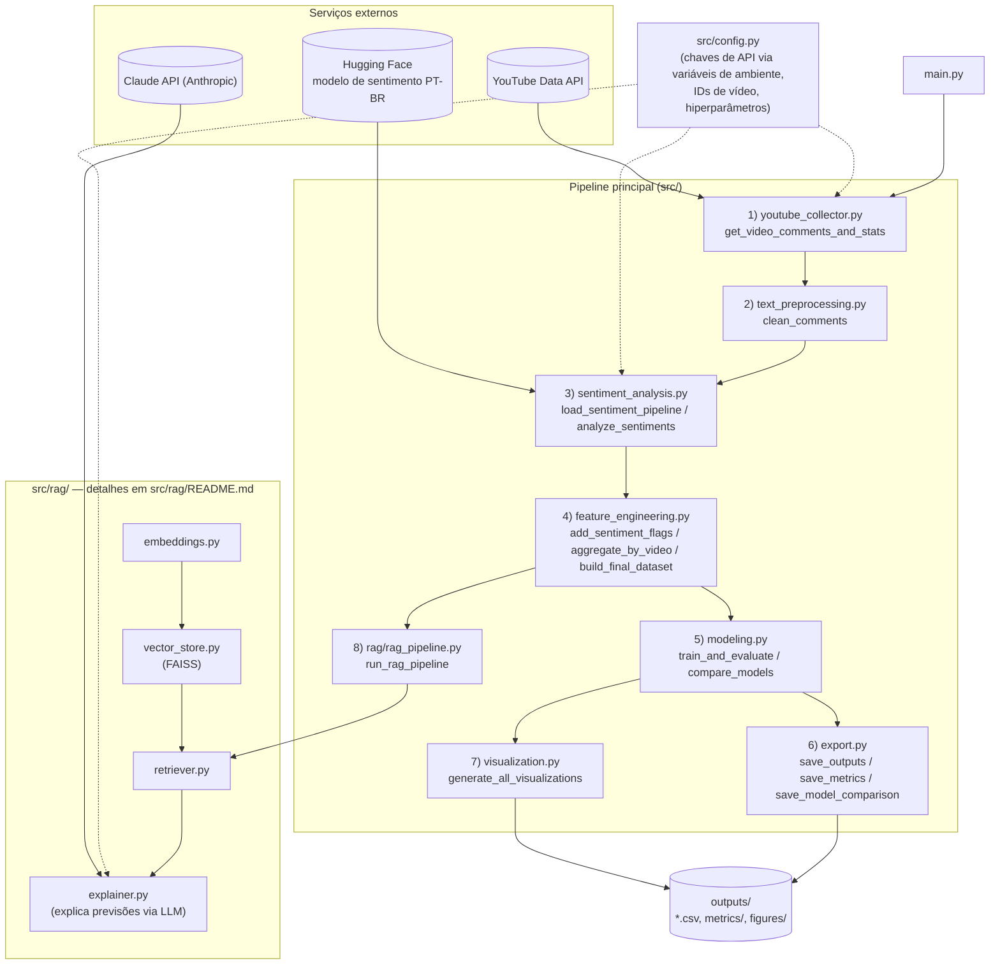

# Arquitetura do Projeto

> Este arquivo foi consolidado em [`ARCHITECTURE.md`](../ARCHITECTURE.md), na raiz do projeto (árvore completa + diagrama + fluxo do pipeline + responsabilidade de cada arquivo em um único documento). Mantido aqui por compatibilidade; use o arquivo da raiz como referência principal.

Pipeline modular para predição de engajamento em vídeos do YouTube a partir da análise de sentimento dos comentários, com uma camada RAG opcional para explicar as previsões em linguagem natural.

> Para o detalhamento etapa a etapa (entradas/saídas exatas de cada função), ver [`pipeline.md`](pipeline.md).

## Diagrama



## Fluxo de dados (DataFrames)

| Etapa | Função | Entrada | Saída |
|---|---|---|---|
| 1 | `get_video_comments_and_stats` | `video_ids` | `df_comments` (`video_id`, `text`), `df_videos` (`video_id`, `video_title`, `views`, `likes`, `total_comments_count`) |
| 2 | `clean_comments` | `df_comments` | `df_comments` + `cleaned_text` |
| 3 | `analyze_sentiments` | `df_comments` | `df_comments` + `label`, `score` |
| 4 | `add_sentiment_flags` → `aggregate_by_video` → `build_final_dataset` | `df_comments`, `df_videos` | `df_final` (`prop_positivo/negativo/neutro`, `qtd_comentarios_coletados`, `engagement_rate`, `engagement_class`) |
| 5 | `train_and_evaluate` / `compare_models` | `df_final` | `model_results` (dict com modelos + métricas), `df_comparison` (tabela multi-modelo) |
| 6–7 | `save_*` / `generate_all_visualizations` | `df_comments`, `df_final`, `model_results`, `df_comparison` | arquivos em `outputs/` |
| 8 | `run_rag_pipeline` | `df_comments` | `retriever` (índice FAISS sobre os comentários) |

## Responsabilidade de cada módulo

| Módulo | Responsabilidade |
|---|---|
| `src/config.py` | Única fonte de constantes e configuração (chaves de API via ambiente, IDs de vídeo, nomes de modelo, diretório de saída). |
| `src/youtube_collector.py` | Coleta comentários e estatísticas via YouTube Data API. |
| `src/text_preprocessing.py` | Limpeza de texto (URLs, menções, hashtags, caracteres especiais). |
| `src/sentiment_analysis.py` | Análise de sentimento via `transformers` (Hugging Face). |
| `src/feature_engineering.py` | Agregação por vídeo e cálculo da métrica alvo (`engagement_rate`/`engagement_class`). |
| `src/modeling.py` | Treino/avaliação de modelos (Random Forest com holdout + K-Fold) e comparação entre múltiplos algoritmos (Linear/Logistic Regression, Random Forest, XGBoost). |
| `src/export.py` | Persistência de DataFrames e métricas como CSV em `outputs/`. |
| `src/visualization.py` | Geração dos gráficos (matplotlib) em `outputs/figures/`. |
| `src/pipeline.py` | Orquestra as 8 etapas acima, na ordem. Único ponto de entrada do fluxo completo (`run_pipeline()`). |
| `src/rag/` | Camada RAG independente do ML — indexação semântica dos comentários (embeddings + FAISS) e explicação das previsões via Claude API. Ver [`src/rag/README.md`](../src/rag/README.md) para a arquitetura interna. |

## Dependências externas

| Serviço | Usado por | Autenticação |
|---|---|---|
| YouTube Data API v3 | `youtube_collector.py` | `YOUTUBE_API_KEY` (variável de ambiente) |
| Modelo de sentimento (Hugging Face) | `sentiment_analysis.py` | nenhuma (download público do modelo) |
| Claude API (Anthropic) | `rag/explainer.py` | `ANTHROPIC_API_KEY` (variável de ambiente) |

## Estrutura de diretórios

```
TCC_Engajamento/
├── main.py                 # ponto de entrada (python main.py)
├── requirements.txt
├── tcc_script.py            # script original da orientadora, mantido como referência
├── docs/
│   └── architecture.md      # este arquivo
├── src/
│   ├── config.py
│   ├── youtube_collector.py
│   ├── text_preprocessing.py
│   ├── sentiment_analysis.py
│   ├── feature_engineering.py
│   ├── modeling.py
│   ├── export.py
│   ├── visualization.py
│   ├── pipeline.py
│   └── rag/
│       ├── README.md        # arquitetura detalhada do módulo RAG
│       ├── embeddings.py
│       ├── vector_store.py
│       ├── retriever.py
│       ├── rag_pipeline.py
│       └── explainer.py
└── outputs/                 # gerado em runtime: CSVs, metrics/, figures/
```

## Observações

- Não há acoplamento entre a camada RAG (`src/rag/`) e a modelagem preditiva (`src/modeling.py`) — o `retriever` construído na etapa 8 é retornado por `run_pipeline()` mas não realimenta o treino dos modelos.
- `src/config.py` é a única fonte de verdade para configuração; os demais módulos recebem valores como parâmetros de função (sem ler `config` diretamente), exceto `rag/explainer.py`, que usa `config.ANTHROPIC_MODEL` como valor padrão de parâmetro.
