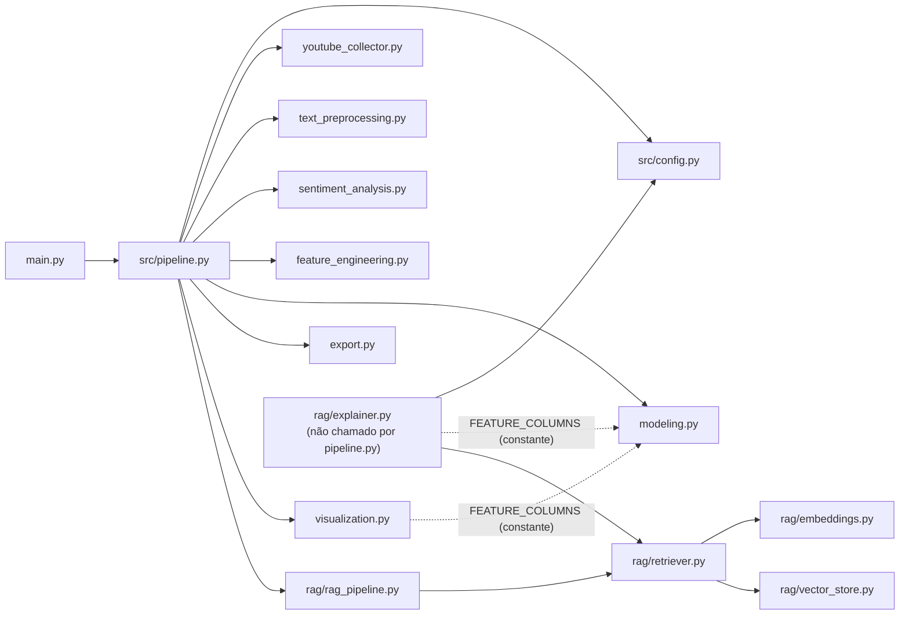

# Dependências entre Módulos — Quem Chama Quem

Grafo de imports interno (`from src...`) levantado diretamente do código-fonte (não é um resumo de memória). Cada seta abaixo é um `import` real, não uma relação conceitual.

## Grafo de dependências

## Tabela — imports internos por arquivo

| Arquivo | Importa de (`src.*`) | O que usa |
|---|---|---|
| `main.py` | `src.pipeline` | `run_pipeline` |
| `src/pipeline.py` | `src.config`, `src.youtube_collector`, `src.text_preprocessing`, `src.sentiment_analysis`, `src.feature_engineering`, `src.modeling`, `src.export`, `src.visualization`, `src.rag.rag_pipeline` | orquestra todas as 8 etapas |
| `src/visualization.py` | `src.modeling` | só a constante `FEATURE_COLUMNS` (para rotular o gráfico de importância de features) |
| `src/rag/rag_pipeline.py` | `src.rag.retriever` | `build_retriever` |
| `src/rag/retriever.py` | `src.rag.embeddings`, `src.rag.vector_store` | `load_embedding_model`, `generate_embeddings`, `build_index`, `search` |
| `src/rag/explainer.py` | `src.config`, `src.modeling`, `src.rag.retriever` | `config.ANTHROPIC_MODEL`; `FEATURE_COLUMNS`; `retrieve_top_k` |
| `src/config.py` | — | (nenhum import interno) |
| `src/youtube_collector.py` | — | (nenhum import interno) |
| `src/text_preprocessing.py` | — | (nenhum import interno) |
| `src/sentiment_analysis.py` | — | (nenhum import interno) |
| `src/feature_engineering.py` | — | (nenhum import interno) |
| `src/modeling.py` | — | (nenhum import interno) |
| `src/export.py` | — | (nenhum import interno) |
| `src/rag/embeddings.py` | — | (nenhum import interno) |
| `src/rag/vector_store.py` | — | (nenhum import interno) |

## Leitura do grafo

- **`src/pipeline.py` é o único orquestrador** — todas as etapas do pipeline principal (1–8) são importadas exclusivamente por ele. Nenhum módulo de etapa importa outro módulo de etapa diretamente (ex.: `modeling.py` não importa `feature_engineering.py`) — o acoplamento entre etapas acontece só via `pipeline.py` passando DataFrames de uma função para a próxima, não via import.
- **9 módulos são folhas** (sem nenhum import interno: `config.py`, `youtube_collector.py`, `text_preprocessing.py`, `sentiment_analysis.py`, `feature_engineering.py`, `modeling.py`, `export.py`, `rag/embeddings.py`, `rag/vector_store.py`) — testáveis isoladamente, sem precisar instanciar o resto do projeto.
- **Único import "cruzado" fora da cadeia principal**: `visualization.py` e `rag/explainer.py` importam `FEATURE_COLUMNS` de `modeling.py` — não é lógica, só a lista de nomes das 4 features, usada para rotular gráficos/prompts. Isso significa que ambos arrastam `scikit-learn`/`xgboost` transitivamente (via `modeling.py`) mesmo sem treinar nada.
- **`rag/explainer.py` não é importado por `pipeline.py`** — é o único arquivo do projeto (fora `tcc_script.py`, que é a referência original) que não faz parte do grafo de chamadas do `run_pipeline()`. É invocado manualmente pelo usuário.
- **Sem imports circulares** — o grafo é um DAG (grafo acíclico dirigido); `src/modeling.py` nunca importa nada de `src/rag/`, por exemplo, então a dependência `rag → modeling` é estritamente unidirecional.
- **`src/rag/` depende só de si mesmo + `config.py` + `modeling.FEATURE_COLUMNS`** — nenhum módulo do pipeline principal (`youtube_collector.py` até `visualization.py`) importa nada de `src/rag/`, exceto `pipeline.py`, que importa `rag/rag_pipeline.py` como a etapa 8.

Para a ordem de execução (não só de import) e o que cada etapa recebe/produz, ver [`pipeline.md`](pipeline.md).
